# comparetout-doc
This page describes the android app "Compare Time Of Use Tariffs".

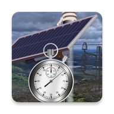

## Purpose
The app compares electricity time of use tariffs with data that you provide to get a realistic estimate of expected annual charges.

Time of use tariffs are complex, and the app aims to simplify the process of gathering information and calculating figures useful for comparison.

## Top level concepts
There are three main tabs in the app. Usage, Costs and Comparisons.

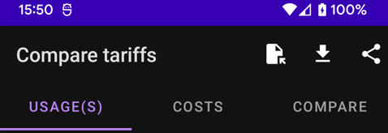

The comparisons can only be shared.

For usage and cost, you can:
* Load from file
* Download from the internet
* Share with others
* Create a new entry

Once usage and costs have defined (loaded, downloaded, or created)
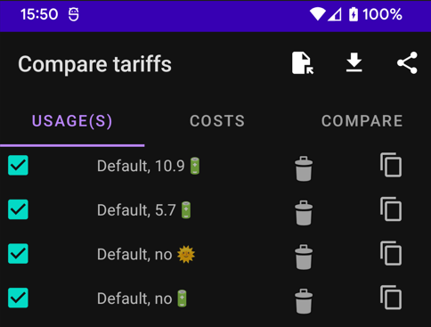

You can:
* Select to be included in the comparison
* View/Edit (by clicking on the text)
* Delete
* Copy to create a new usage/cost based on an existing one

## Usage
### What is a usage
Usage describes how you use and optionally generate electricity.
There are six distinct areas of usage. The only mandatory area is the "Load Profile". All other areas are optional:

* **Load profiles** describe domestic usage of electricity. The are many sources of this data supported in the app.
* **Inverters** convert AC electricity to and from DC. An inverter are required to define solar panels or batteries.
* **Solar panels** provide DC electricity based on physical aspect. There are several sources of solar data supported by the app.
* **Batteries** store DC electricity for later consumption. They have characteristics, and may be charged from the grid based on schedules.
* **Hot water** can be used to store useful energy from solar panels. The app provides a simple model of a how water system and allows for scheduled water heating, and diversion of surplus solar electricity (after normal house load is satisfied).
* **Electric vehicles** can be charged on either a schedule, or using a diversion of surplus solar electricity (after normal house load is satisfied).

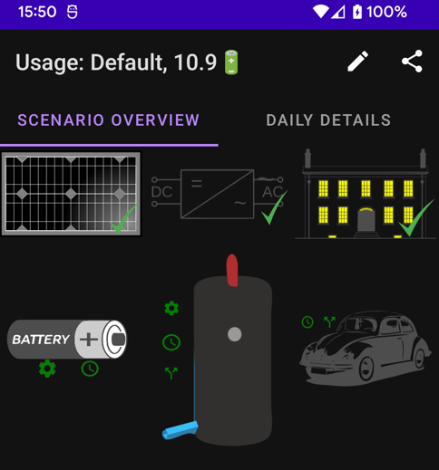

The button images in the view/edit usage correspond to the usage areas above. A green tick (or absence) indicates if load profile, inverter or panels have been defined.

The green icons on the battery, hot water and EV indicate that settings, schedules and diversions have been configured (or not, shaded icons).

Once the mandatory areas are configured, the app will automatically simulate usage and generate costs (at least one cost must be defined) for a single year. When simulation is complete some key overview indicators are provided.

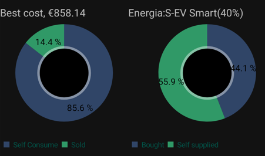
* The best cost found
* The supplier and plan that provided the cost
* The amount of generated electricity (if applicable) used and exported
* The amount of used electricity that was purchased and generated

The DAILY DETAILS tab will also be populated when the simulation is complete. You can navigate the simulation output to get an insight into why the costs are the way they are.
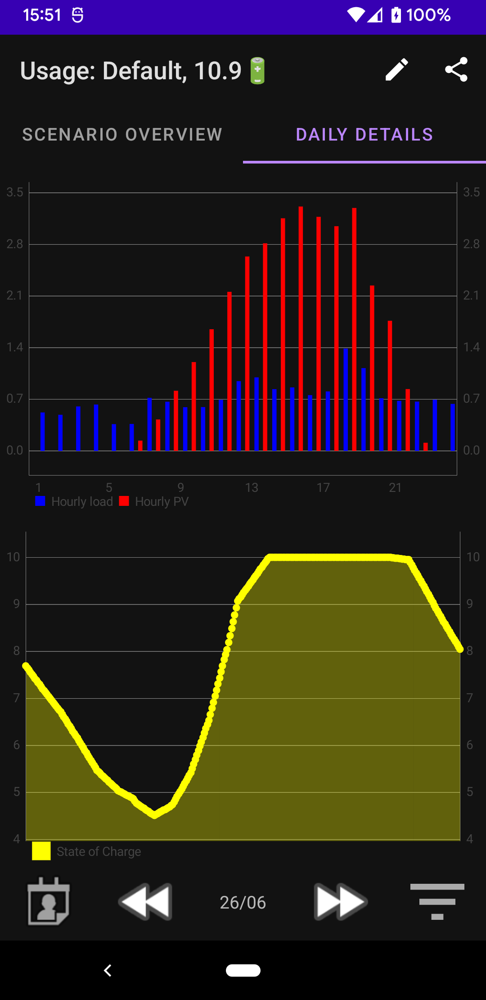
### Usage area details
A usage must be saved with a unique name before adding any usage area. Newly created usage will be in edit mode already. 

#### Load Profile
Load profiles are the only mandatory usage area. 

A load profile consists of some basic usage data and three distributions.

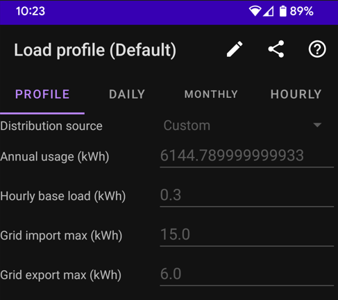

Distributions show how electricity usage is spread across hours, days, months. This accounts for habit and seasonal variations. Each distribution totals 100% of andual usage.

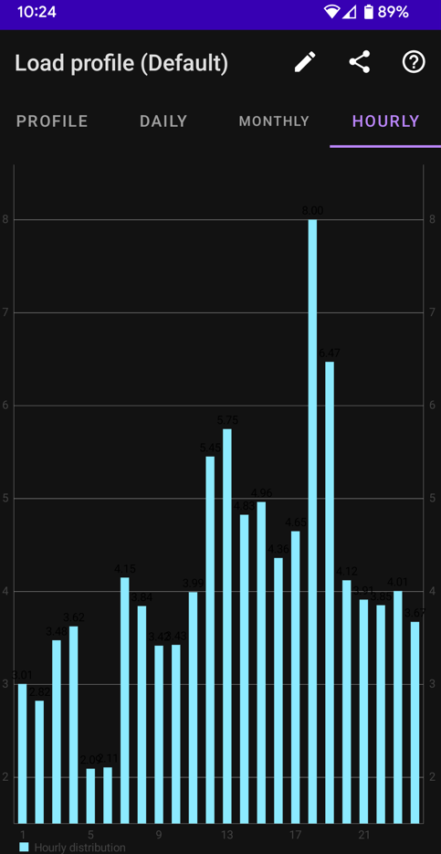

When you edit a load profile, you can import from a file, copy from or link to a load profile defined in another usage.

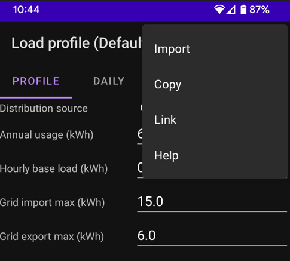

Linking or copying will show a list of usages that can be used as source.

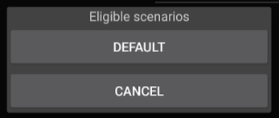

When usage areas are linked, a link icon appears in the bottom left of the screen. Clicking on this icon will show a list of the usages that are linked.

In edit mode, it is also possible to select a standard load profile. Standard load profiles are published annually by ESBN. These are from Nov 2022.

More load profile sources will be added in later versions of the app. For now a simple editor is provided if the standard load profiles do not satisfy.

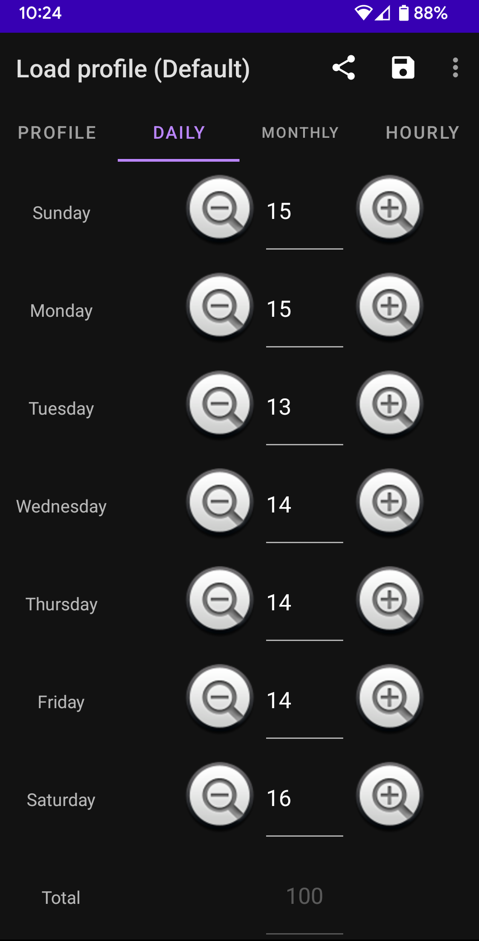

#### Inverters
Inverters are key components in how solar/battery systems are connected to you house. They are not perfect, energy is lost (in the form of heat) whenever a DC <-> AC conversion happens.

This area captures the key characteristics of an inverter, capacity and losses for the various conversions, the number of ports (for solar panels) and the minimum excess required before battery charging will happen.

All of this information should be abailable from the manufacturer specification. A food round trip estimation for loss is 20%.

Inverter names need to be unique within a usage. The inverter name is used to connect panels and batteries to the house.

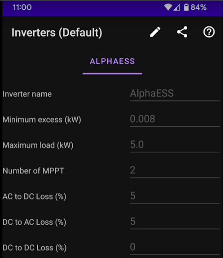

When editing, you can import, copy, link delete and add an inverter.

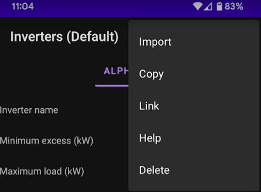

Multiple hybrid string inverters are quite tricky in the real world. Please get professional advise before have more than one inverter attached to you home.

#### Solar Panels
Solar panels are connected to inveter ports (MPPT -- Maximum Power Point Tracking). To distinguish different strings a name is needed. The number of panels in a string and the maximim power output is needed. When a panel (string) is fully configured the monthly generation is shown at the bottom of the screen.

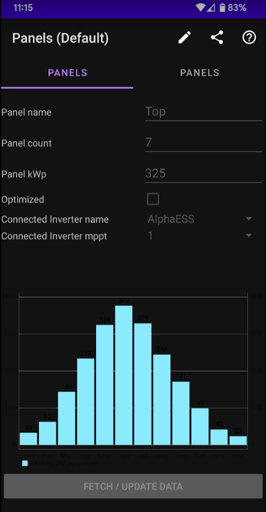

Editing panels allows for import, copy, link, add, delete, and fetching data

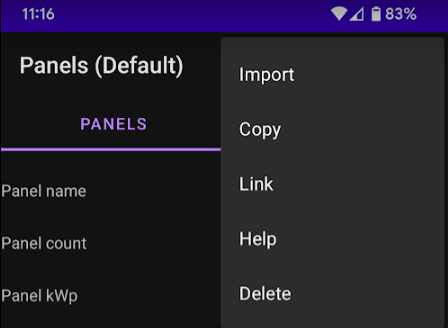

If the monthly generation is missing from the bottom of the screen, or you would like to refresh it, you can fetch/update data. For now only a single data source is supported. Later version of the app will add more.

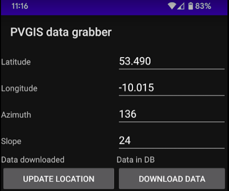

The information on this screen is stored on you device. Location data can be refreshed using the current location on your device (if available/permitted). The data is used to query the PVGIS database. Data downloaded from PVGIS is stored as-is in your downloads folder. Relevant data is extracted from this file and added to the apps internal DB.

Deleting the panel will remove all of this data from the device.

#### Batteries

Batteries may be configured and scheduled for charging. Clicking on the battery image will open a menu.

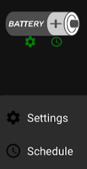

##### Battery configuration

Battery configuration associates a battery with one of the inverters defined above. Some vital statistics are also needed to simulate correctly.
* How big is the battery
* At what percentage should discharge be stopped
* How much can the battery provide in 5 minutes
* How much can the battery charge in 5 minutes
* How much energy is lost by storing in the battery

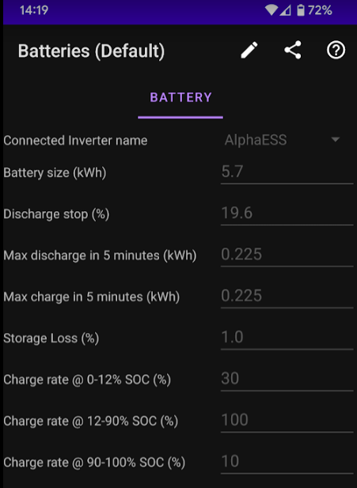

Batteries (really battery management systems) try to protect themselves. When they are completely depeleted or nearly full, the charge rate drops. The app uses a simple model that reduces the maximum charge rate to a percentage based on the state of charge.

Editing the battery allows for import, copy, link add and delete.

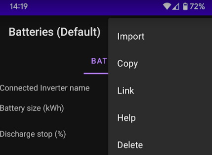

##### Battery charging from grid schedule
Load shifting (scheduled charging the battery from the grid) will be added in a later varsion of the app.
#### Hot water
Hot water systems will be added in a later version of the app.
#### Electric Vehicle
Electriv vehicles will be added in a later version of the app.

## Cost

## Compare

## General navigation