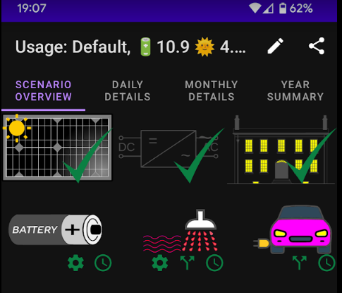

# comparetout-doc
This page describes the android app "Compare Time Of Use Tariffs".

## Purpose
The app compares electricity time of use tariffs with data that you provide to get a realistic estimate of expected annual charges.

Time of use tariffs are complex, and the app aims to simplify the process of gathering information and calculating figures useful for comparison.

## Top level concepts
There are three main tabs in the app. Usage, Costs and Comparisons.

The comparisons can only be shared.

For usage and cost, you can:
* Load from file
* Download from the internet
* Share with others
* Create a new (Usage or Cost)

Once usage and costs have defined (loaded, downloaded, or created)

You can:
* Select to be included in the comparison
* View/Edit (by clicking on the text)
* Delete
* Copy to create a new usage/cost based on an existing one

## Usage
### What is a usage
Usage describes how you use and optionally generate electricity.
There are six distinct areas of usage. The only mandatory area is the "Load Profile". All other areas are optional:

* **Load profiles** describe domestic usage of electricity. The are many sources of this data supported in the app.
* **Inverters** convert AC electricity to and from DC. An inverter are required to define solar panels or batteries.
* **Solar panels** provide DC electricity based on physical aspect. There are several sources of solar data supported by the app.
* **Batteries** store DC electricity for later consumption. They have characteristics, and may be charged from the grid based on schedules.
* **Hot water** can be used to store useful energy from solar panels. The app provides a simple model of a how water system and allows for scheduled water heating, and diversion of surplus solar electricity (after normal house load is satisfied).
* **Electric vehicles** can be charged on either a schedule, or using a diversion of surplus solar electricity (after normal house load is satisfied).

The button images in the view/edit usage correspond to the usage areas above. A green tick (or absence) indicates if load profile, inverter or panels have been defined.

The green icons on the battery, hot water and EV indicate that settings, schedules and diversions have been configured (or not, shaded icons).

Once the mandatory areas are configured, the app will automatically simulate usage and generate costs (at least one cost must be defined) for a single year. When simulation is complete some key overview indicators are provided.

* The best cost found
* The supplier and plan that provided the cost
* The amount of generated electricity (if applicable) used and exported
* The amount of used electricity that was purchased and generated

The DAILY DETAILS tab will also be populated when the simulation is complete. You can navigate the simulation output to get an insight into why the costs are the way they are.

### Usage details
A usage must be saved with a unique name before adding any usage area. Newly created usage will be in edit mode already. 

#### Load Profile
Load profiles are the only mandatory usage area.
#### Inverters
#### Solar Panels
#### Batteries
#### Hot water
#### Electric Vehicle

## Cost

## Compare

## General navigation